# Projektdokumentation – M158 LB2  WordPress-Migration

## Übersicht
# Projektdokumentation – Webserver-Projekt

Diese Dokumentation ist nach den Aufgaben (1–14) gegliedert. Jede Aufgabe ist in drei Phasen unterteilt. Bitte tragen Sie Ihre Ergebnisse jeweils unter den entsprechenden Abschnitten ein.

---

## Aufgabe 1 – Projektplan erstellen

### Stufe 3

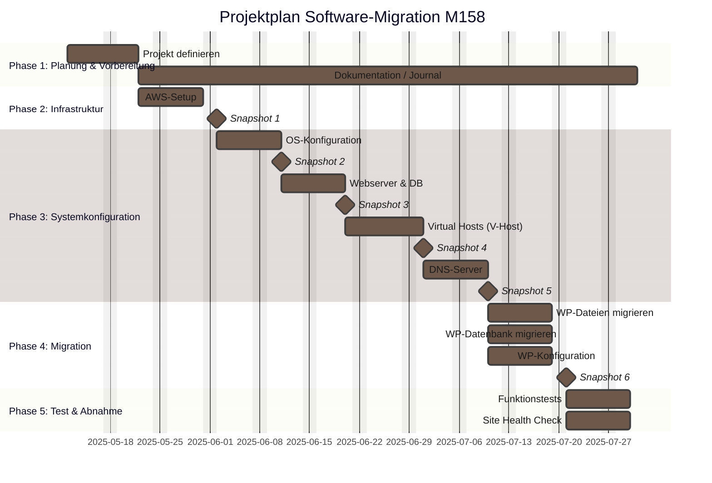

## Aufgabe 2 – Architekturdiagramm erstellen

### Stufe 1

Fügen Sie hier Ihre Ergebnisse ein

### Stufe 2

Fügen Sie hier Ihre Ergebnisse ein

### Stufe 3

Fügen Sie hier Ihre Ergebnisse ein

---

## Aufgabe 3 – AWS-Umgebung einrichten

### Stufe 1

Fügen Sie hier Ihre Ergebnisse ein

### Stufe 2

Fügen Sie hier Ihre Ergebnisse ein

---

## Aufgabe 4 – DNS-Konfiguration

Ändern Sie die Stufe, für die Sie sich entschieden haben, selbst.

### Stufe ?

Fügen Sie hier Ihre Ergebnisse ein

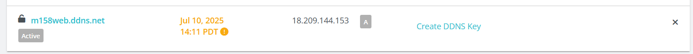

## Aufgabe 5 – Webserver konfigurieren

### Stufe 1
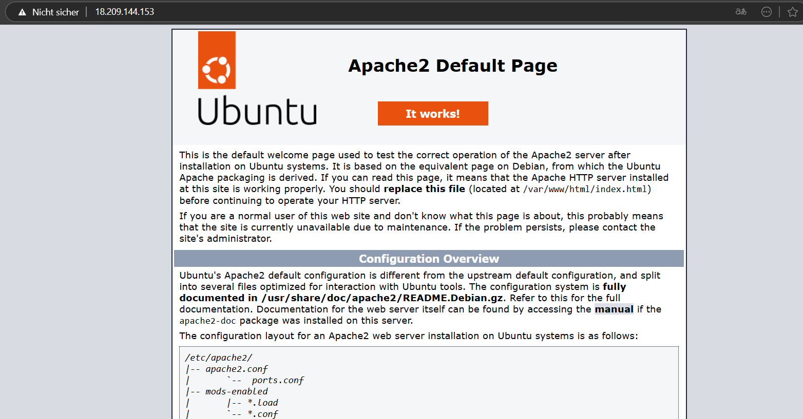
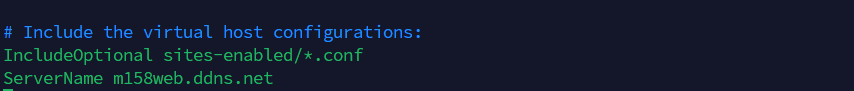
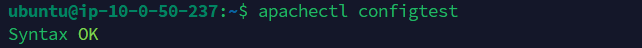
### Stufe 2
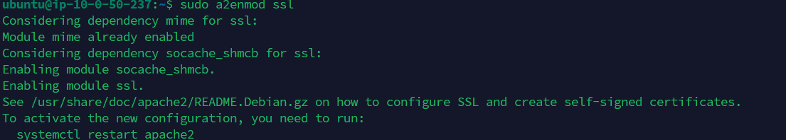
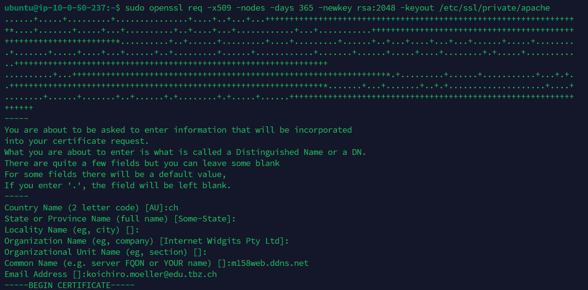

### Stufe 3
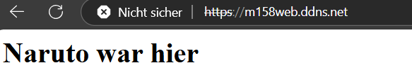
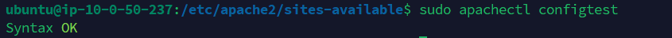

## Aufgabe 6 – PHP einrichten

### Stufe 1

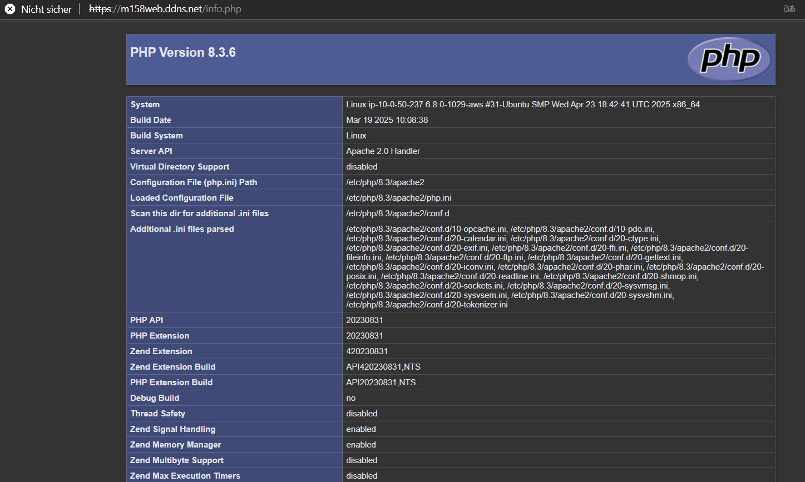

### Stufe 2

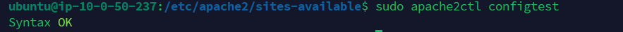

### Stufe 3
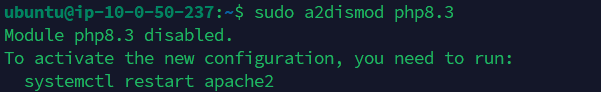
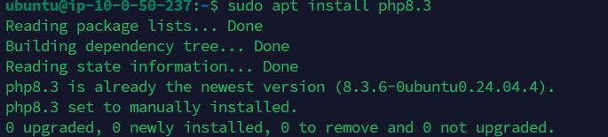
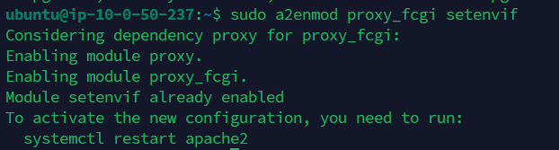
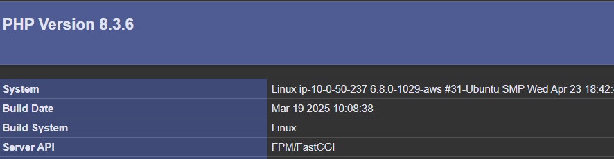

## Aufgabe 7 – MySQL/MariaDB aufsetzen

### Stufe 1

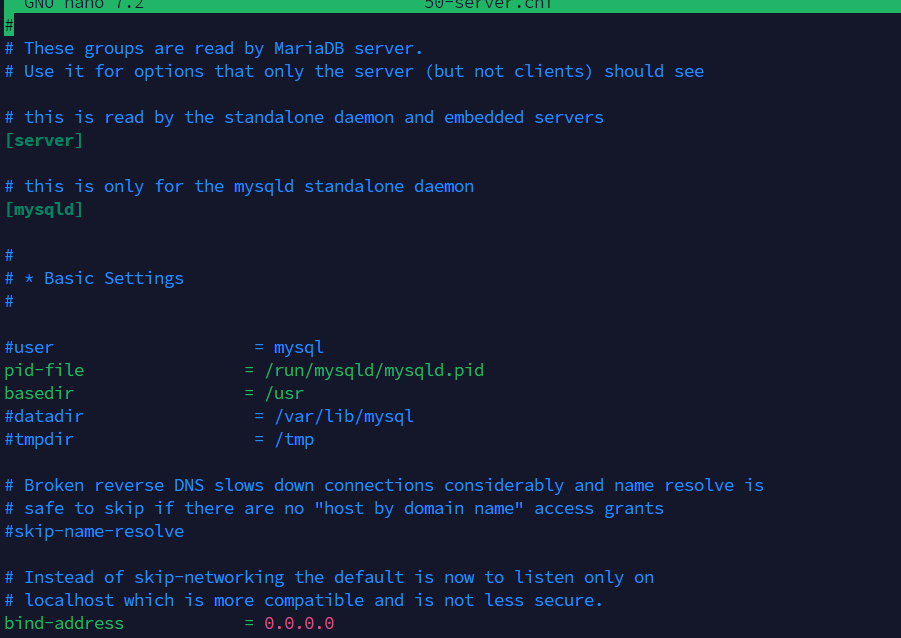
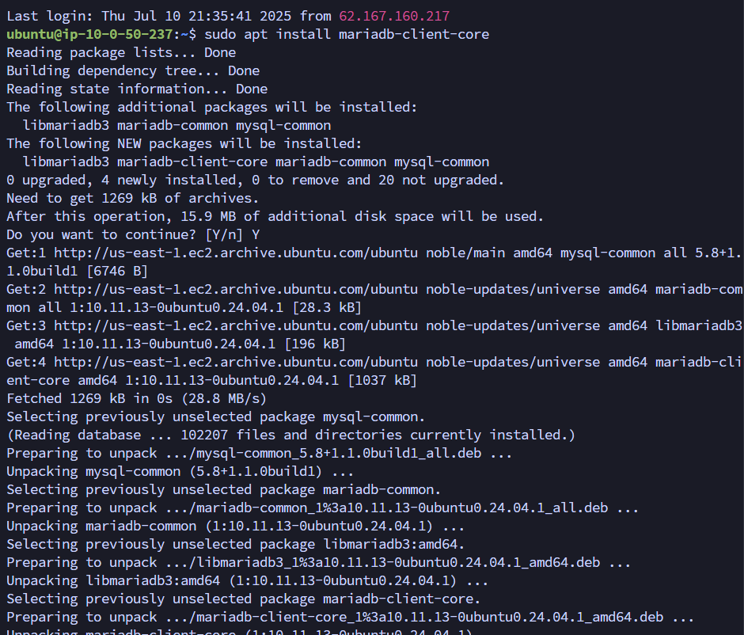
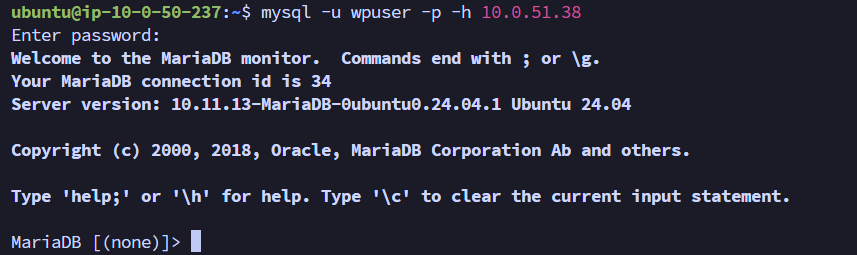
### Stufe 2

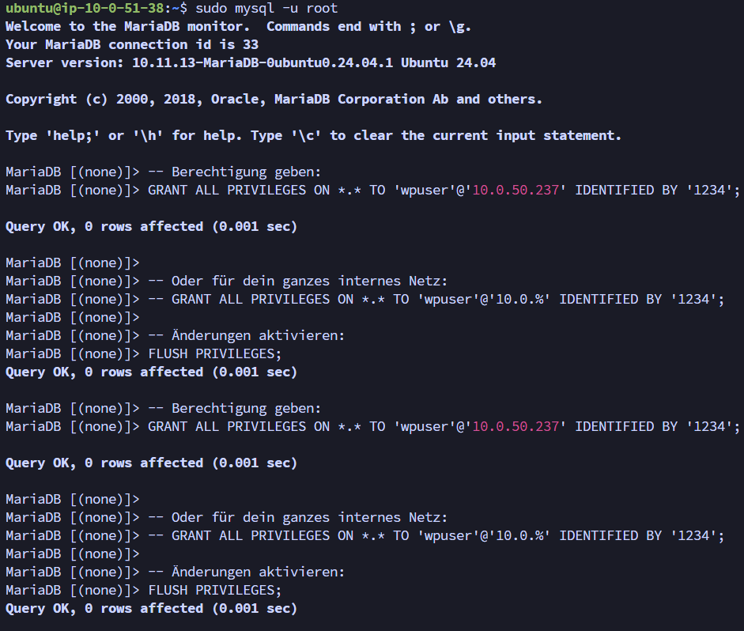

### Stufe 3

Ich habe einen Webserver und DB also 2 Instanzen.

---

## Aufgabe 8 – Web-Datenbanktool phpMyAdmin

### Stufe 1

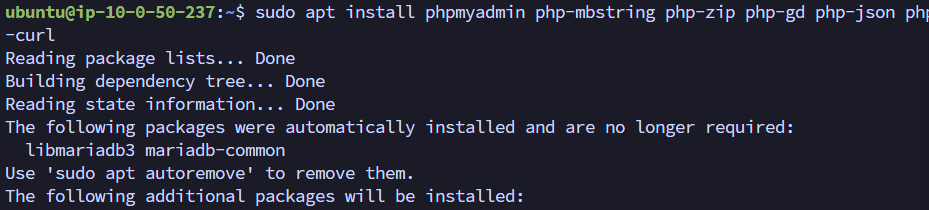

### Stufe 2

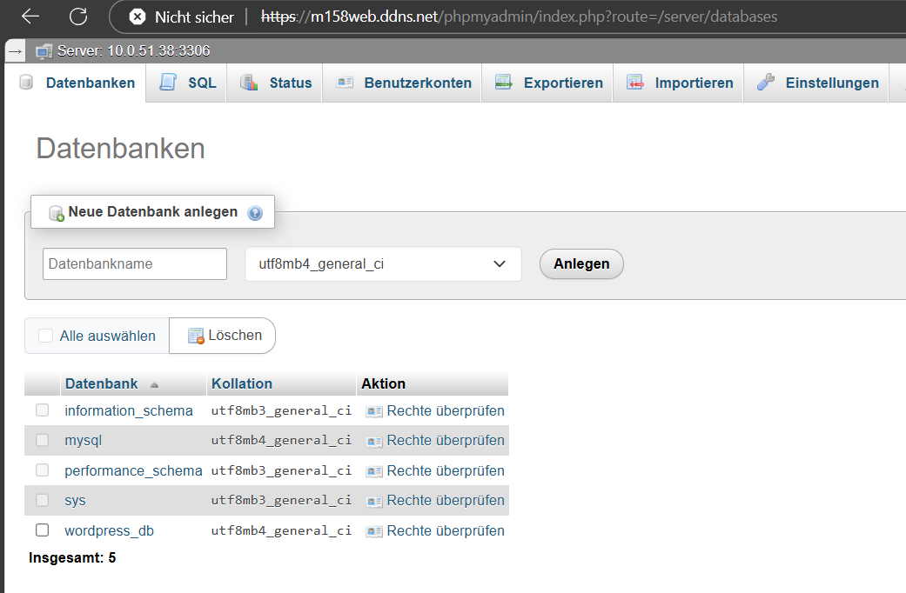
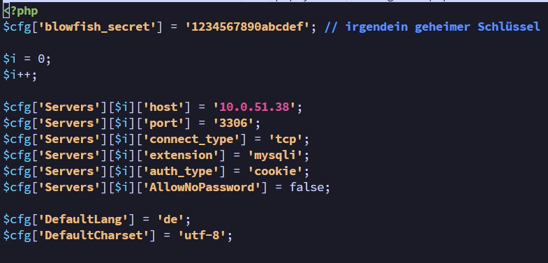
### Stufe 3

Ich habe einen Webserver und eine DB also 2 Instanzen.

---

## Aufgabe 9 – FTP-Zugang einrichten

### Stufe 1

Fügen Sie hier Ihre Ergebnisse ein

### Stufe 2

Fügen Sie hier Ihre Ergebnisse ein

---

## Aufgabe 10 – WordPress migrieren

### Stufe 1

Fügen Sie hier Ihre Ergebnisse ein

### Stufe 2

Fügen Sie hier Ihre Ergebnisse ein

### Stufe 3

Fügen Sie hier Ihre Ergebnisse ein

---

## Aufgabe 11 – Backup-Konzept umsetzen

### Stufe 1

Fügen Sie hier Ihre Ergebnisse ein

### Stufe 2

Fügen Sie hier Ihre Ergebnisse ein

---

## Aufgabe 12 – Testing der Webapplikation

### Stufe 1

Fügen Sie hier Ihre Ergebnisse ein

### Stufe 2

Fügen Sie hier Ihre Ergebnisse ein

### Stufe 3

Fügen Sie hier Ihre Ergebnisse ein

---

## Aufgabe 13 – Deployment automatisieren

### Stufe 1

Fügen Sie hier Ihre Ergebnisse ein

### Stufe 2

Fügen Sie hier Ihre Ergebnisse ein

### Stufe 3

Fügen Sie hier Ihre Ergebnisse ein

---

## Aufgabe 14 – Docker verwenden

### Stufe 1

Fügen Sie hier Ihre Ergebnisse ein

### Stufe 2

Fügen Sie hier Ihre Ergebnisse ein

### Stufe 3

Fügen Sie hier Ihre Ergebnisse ein

---
