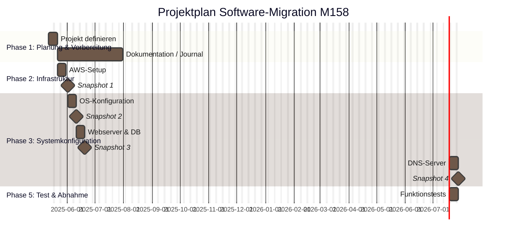
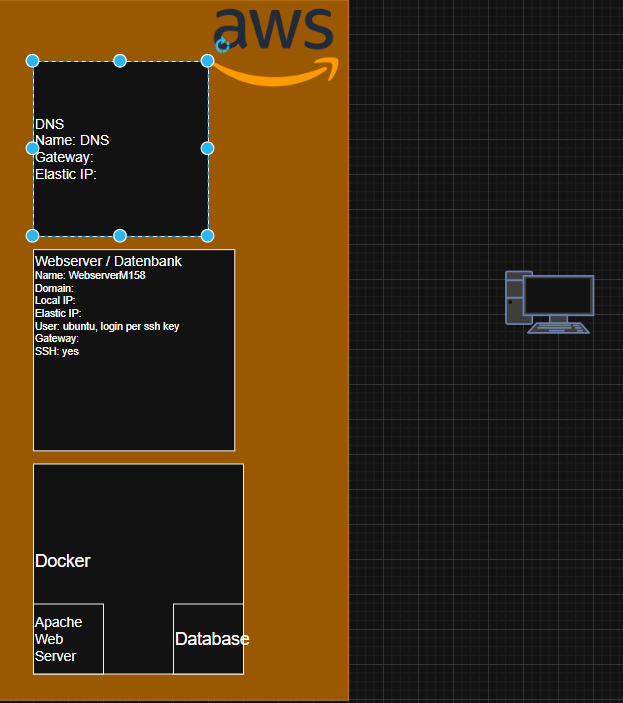
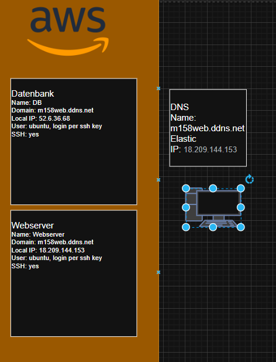
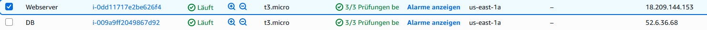
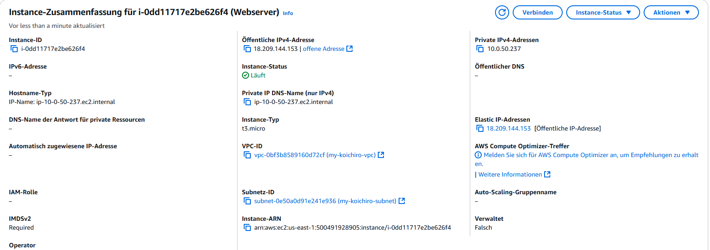
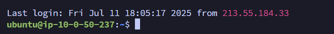
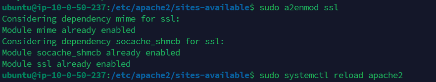

# Projektdokumentation – M158 LB2  

# Projektdokumentation – Webserver-Projekt

## Aufgabe 1 – Projektplan erstellen

### Stufe 3

## Aufgabe 2 – Architekturdiagramm erstellen

### Stufe 1
Ich hatte vor mit diesem Architekturdiagramm zu arbeiten. Jedoch habe ich meine Meinung im Verlauf des Projekts geändert und hatte keine Zeit eine neues Architekturdiagramm zu erstellen

### Stufe 2
Das war die zweite Version die ich am Anfang geplant habe aber nicht abschliessen konnte

### Stufe 3

---

## Aufgabe 3 – AWS-Umgebung einrichten

### Stufe 1

### Stufe 2

### Stufe 3

---

## Aufgabe 4 – DNS-Konfiguration

### Stufe 3

Fügen Sie hier Ihre Ergebnisse ein

## Aufgabe 5 – Webserver konfigurieren

### Stufe 1
Nach der erfolgreichen Installation und Konfiguration des Apache2-Webservers wird beim Aufruf der Server-IP oder Domain im Browser die Standardseite von Apache angezeigt.

### Stufe 2

### Stufe 3

## Aufgabe 6 – PHP einrichten

### Stufe 1
php erscheint über den mit DNS gesetzten url

### Stufe 2

### Stufe 3

## Aufgabe 7 – MySQL/MariaDB aufsetzen

### Stufe 1
Hier wird mariaDB und MySQL heruntergeladen und eingerichtet

mariaDB client wird heruntergeladen für den Zugriff von Webserver auf MariaDB

### Stufe 2
Auf das heruntergeladene MariaDB die Datenbank und User erstellen

### Stufe 3

Ich habe einen Webserver und DB also 2 Instanzen.

---

## Aufgabe 8 – Web-Datenbanktool phpMyAdmin

### Stufe 1
phpmyadmin wird heruntergeladen

### Stufe 2
Über Website auf phpmyadmin zugreifen

File wird konfiguriert

### Stufe 3

Ich habe einen Webserver und eine DB also 2 Instanzen.

---

## Aufgabe 9 – FTP-Zugang einrichten

### Stufe 1

Fügen Sie hier Ihre Ergebnisse ein

### Stufe 2

Fügen Sie hier Ihre Ergebnisse ein

---

## Aufgabe 10 – WordPress migrieren

### Stufe 1

Fügen Sie hier Ihre Ergebnisse ein

### Stufe 2

Fügen Sie hier Ihre Ergebnisse ein

### Stufe 3

Fügen Sie hier Ihre Ergebnisse ein

---

## Aufgabe 11 – Backup-Konzept umsetzen

### Stufe 1

Fügen Sie hier Ihre Ergebnisse ein

### Stufe 2

Fügen Sie hier Ihre Ergebnisse ein

---

## Aufgabe 12 – Testing der Webapplikation

### Stufe 1

Fügen Sie hier Ihre Ergebnisse ein

### Stufe 2

Fügen Sie hier Ihre Ergebnisse ein

### Stufe 3

Fügen Sie hier Ihre Ergebnisse ein

---

## Aufgabe 13 – Deployment automatisieren

### Stufe 1

Fügen Sie hier Ihre Ergebnisse ein

### Stufe 2

Fügen Sie hier Ihre Ergebnisse ein

### Stufe 3

Fügen Sie hier Ihre Ergebnisse ein

---

## Aufgabe 14 – Docker verwenden

### Stufe 1

Fügen Sie hier Ihre Ergebnisse ein

### Stufe 2

Fügen Sie hier Ihre Ergebnisse ein

### Stufe 3

Fügen Sie hier Ihre Ergebnisse ein

---
